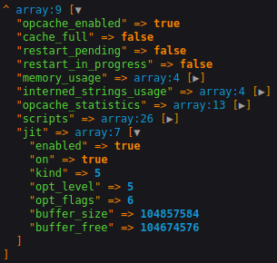
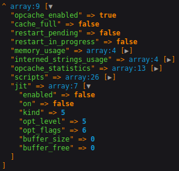

# Docker PHP Circular JIT Dependency Dropped

Xdebug v3.0 overrides `zend_execute_ex()` function call. This causes JIT to be deactivated when Xdebug is on.

## Run with Xdebug off

To see that JIT is working, build this repository following these steps, where Xdebug is off:

```
export ENABLE_XDEBUG=0
docker-compose build
docker-compose up -d
docker-compose exec php composer install
```

Check Docker logs for PHP container to see that there are no errors:

```
docker logs php
```

You will get following output:

```
[15-Sep-2021 12:00:00] NOTICE: fpm is running, pid 1
[15-Sep-2021 12:00:00] NOTICE: ready to handle connections
```

Then go to http://127.0.0.1:8080 in your browser and you will see following dump of `opcache_get_status()` function call:



Everything is working. Both Opcache and JIT are enabled. Now shut down containers:

```
docker-compose down
```

## Run with Xdebug on

Now, to see that JIT is not working, when Xdebug is on, build this repository following these steps:

```
export ENABLE_XDEBUG=1
docker-compose build
docker-compose up -d
docker-compose exec php composer install
```

Check Docker logs for PHP container to see the errors:

```
docker logs php
```

You will get following output:

```
<br />
<b>Warning</b>:  JIT is incompatible with third party extensions that override zend_execute_ex(). JIT disabled. in <b>Unknown</b> on line <b>0</b><br />
[15-Sep-2021 12:00:00] NOTICE: fpm is running, pid 1
[15-Sep-2021 12:00:00] NOTICE: ready to handle connections
```

Then go to http://127.0.0.1:8080 in your browser and you will see following dump of `opcache_get_status()` function call:



As you can see, Opcache is enabled, but Xdebug causes JIT to be deactivated. Now shut down containers:

```
docker-compose down
```
